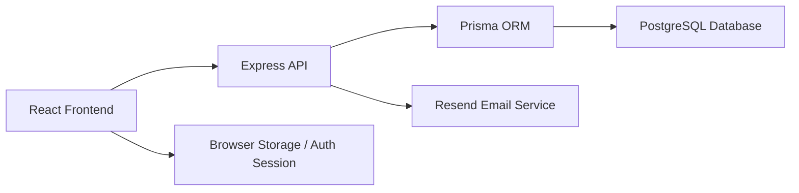

# TaskNode

<p align="center">
  
  
  
  
</p>

TaskNode is a sleek productivity app for managing projects, tasks, deadlines, and account settings in one place. It combines a modern React frontend with a secure Express + Prisma backend to give teams and individuals a clear, focused workflow.

## Why TaskNode

- Organize work into projects with clearly scoped tasks
- Track status through To Do, In Progress, and Done
- Keep due dates visible and actionable
- Use secure authentication and password reset flows
- Customize the experience through theme and settings controls
- Keep everything backed by a PostgreSQL database

## Tech Stack

### Frontend
- React 19
- TypeScript
- Vite
- React Router
- Tailwind CSS
- shadcn-inspired UI building blocks
- Lucide React icons

### Backend
- Node.js
- Express
- Prisma ORM
- PostgreSQL
- JWT authentication
- bcrypt password hashing
- Zod validation
- Resend email delivery

## Architecture



## Repository Structure

```text
Task Manager/
├── api/
│   ├── prisma/
│   ├── src/
│   ├── .env
│   ├── package.json
│   ├── pnpm-lock.yaml
│   └── README.md
├── frontend/
│   ├── src/
│   ├── public/
│   ├── package.json
│   ├── pnpm-lock.yaml
│   └── README.md
├── README.md
├── .gitignore
└── .env.example (if added later)
```

## Prerequisites

Before you begin, ensure you have:

- Node.js 18+
- pnpm 9+
- PostgreSQL database access
- Resend API key for password reset emails

## Environment Setup

Create an environment file at `api/.env` with the following values:

```env
DATABASE_URL="postgresql://<user>:<password>@<host>:<port>/<database>?sslmode=require&channel_binding=require"
JWT_SECRET="your-super-secret-jwt-key"
JWT_EXPIRES_IN="7d"
PORT=3000
RESEND_API_KEY="your_resend_api_key"
```

### Notes
- `DATABASE_URL` must point to a valid PostgreSQL database.
- `JWT_SECRET` should be a long random secret.
- `RESEND_API_KEY` is required for OTP password-reset emails.

## Installation

Install dependencies for both apps:

```bash
cd api && pnpm install
cd ../frontend && pnpm install
```

## Database Setup

Generate Prisma client and sync the schema:

```bash
cd api
pnpm exec prisma generate
pnpm exec prisma db push
```

If you are using migrations instead of `db push`:

```bash
pnpm exec prisma migrate dev
```

## Running the Application

### 1) Start the backend

```bash
cd api
pnpm run dev
```

The API will run on:

```text
http://localhost:3000
```

### 2) Start the frontend

In a separate terminal:

```bash
cd frontend
pnpm run dev
```

The frontend will run on:

```text
http://localhost:5173
```

## Available Scripts

### API

```bash
pnpm run dev
pnpm run start
pnpm run build
pnpm run prisma:generate
pnpm run studio
```

### Frontend

```bash
pnpm run dev
pnpm run build
pnpm run preview
```

## Core Features

### Authentication
- Sign up and sign in
- JWT-based secure sessions
- Password reset via OTP email code
- Remember-me browser persistence

### Project Management
- Create and organize projects
- Add tasks with statuses and due dates
- View project-level task context
- Search and browse tasks efficiently

### User Experience
- Dashboard overview and analytics-like activity cards
- Theme switching
- Account settings and profile management
- Responsive layout for desktop and smaller screens

## API Routes

```text
POST /api/auth/register
POST /api/auth/login
POST /api/auth/forgot-password
POST /api/auth/reset-password
GET  /api/me
PUT  /api/me
GET  /api/projects
POST /api/projects
GET  /api/projects/:projectId/tasks
POST /api/tasks
PUT  /api/tasks/:taskId
DELETE /api/tasks/:taskId
```

## Production Considerations

- Use a strong random `JWT_SECRET` in production
- Keep all secrets in environment variables
- Use a managed Postgres provider for production deployment
- Configure Resend properly for outgoing emails
- Enable HTTPS and additional hardening before public release

## Contributing

1. Create a feature branch
2. Make focused changes
3. Validate the relevant build or behavior
4. Commit with a clear message
5. Open a pull request for review

## License

This project is currently intended for internal development. If you plan to ship it publicly or commercially, add an appropriate open-source or commercial license before deployment.

## Support

If you run into setup issues, check:

- backend logs in the API terminal
- browser console output for frontend issues
- Prisma connection and database URL validity
- Resend API key validity for reset emails

---

TaskNode is designed to be easy to run locally while still feeling like a real product experience for daily task and project management.
